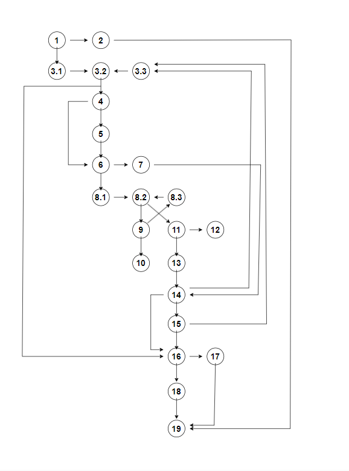

# Втора лабораториска вежба по Софтверско инженерство

## Виктор Китановски, бр. на индекс 225130

###  Control Flow Graph

### Цикломатска комплексност

Цикломатската комплексност на овој код е 10, каде што ја добив преку следната формула
(Број на ребра - Број на јазли) + 2, во случајов имаме 31 ребро, 23 јазли.
(31 - 23) + 2 = 8 + 2 = 10

### Тест случаи според критериумот  Every Branch

Тест број 1 за проверка на листата дали е празна.

Тест број 2 за проверка дали збирот на цените е поголем од износот за плаќање.

Тест број 3 за проверка на листата кога баркодот е валиден, цената е поголема од 300, попуст поголем од 0.

Тест број 4 за исфрлување на исклучок кога листата е null.

Тест број 5 за проверка на листата кога вредноста на баркодот е null.

Тест број 6 за проверка на листата кога испраќаме не валиден баркод.

Тест број 7 за проверка на листата кога името е null.

Тест број 8 за проверка на листата кога испраќаме валидни вредности.

### Тест случаи според критериумот Multiple Condition

Тест број 1 за проверка кога цената е еднаква на 300, попустот е поголем од 0 и баркодот еднаков на 0

Тест број 2 за проверка кога цената е поголема од 300, попустот е еднаков на 0 и баркодот не започнува со 0

Тест број 3 за проверка кога цената е поголема од 300, попустот е еднаков на 0 и баркодот започнува со 0

Тест број 4 за проверка кога цената е поголема од 300, попустот е поголем од 0 и баркодот не започнува на 0

Тест број 5 за проверка кога цената е поголема од 300, попустот е поголем од 0 и баркодот започнува на 0

Тест број 6 за проверка кога цената е еднаква на 300, попустот е еднаков на 0 и баркодот не започнува на 0

Тест број 7 за проверка кога цената е еднаква на 300, попустот е поголем од 0 и баркодот не започнува на 0

Тест број 8 за проверка кога цената е еднаква на 300, попустот е еднаков на 0 и баркодот започнува на 0

### Објаснување на напишаните unit tests

Unit тестовите се добиени од комбинациите со True и False.
Каде што имаме 3 членови односно 2^3 = 8.
Вкупниот број на тестовите ќе изнесува 8
